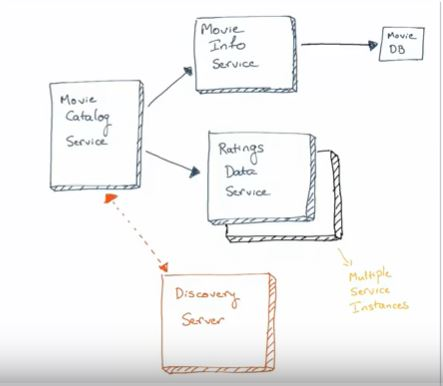
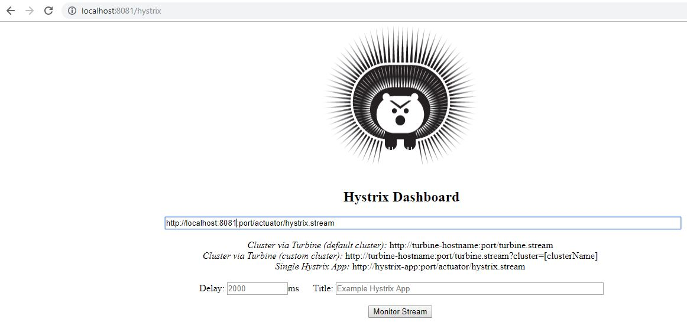

# microservices-after-refactoring


#### Architecture



#### movie-info-service

http://localhost:8082/movies/100


--response 
```

{
    "movieId": "100",
    "name": "Lock, Stock and Two Smoking Barrels",
    "description": "A card shark and his unwillingly-enlisted friends need to make a lot of cash quick after losing a sketchy poker match. To do this they decide to pull a heist on a small-time gang who happen to be operating out of the flat next door."
}
```


#### ratings-data-service

http://localhost:8083/ratingsdata/user/1

--response 
```
{
    "userId": "1",
    "ratings": [
        {
            "movieId": "100",
            "rating": 3
        },
        {
            "movieId": "200",
            "rating": 4
        }
    ]
}
```

#### movie-catalog-service
http://localhost:8081/catalog/15

--response:


```
[
    {
        "name": "Lock, Stock and Two Smoking Barrels",
        "desc": "A card shark and his unwillingly-enlisted friends need to make a lot of cash quick after losing a sketchy poker match. To do this they decide to pull a heist on a small-time gang who happen to be operating out of the flat next door.",
        "rating": 3
    },
    {
        "name": "Star Trek: Insurrection",
        "desc": "When an alien race and factions within Starfleet attempt to take over a planet that has \"regenerative\" properties, it falls upon Captain Picard and the crew of the Enterprise to defend the planet's people as well as the very ideals upon which the Federation itself was founded.",
        "rating": 4
    }
]

```

#### hystrix dashboard

http://localhost:8081/hystrix

#### hystrix




#### access hystrix-dashboard here
http://localhost:8081:port/actuator/hystrix.stream
